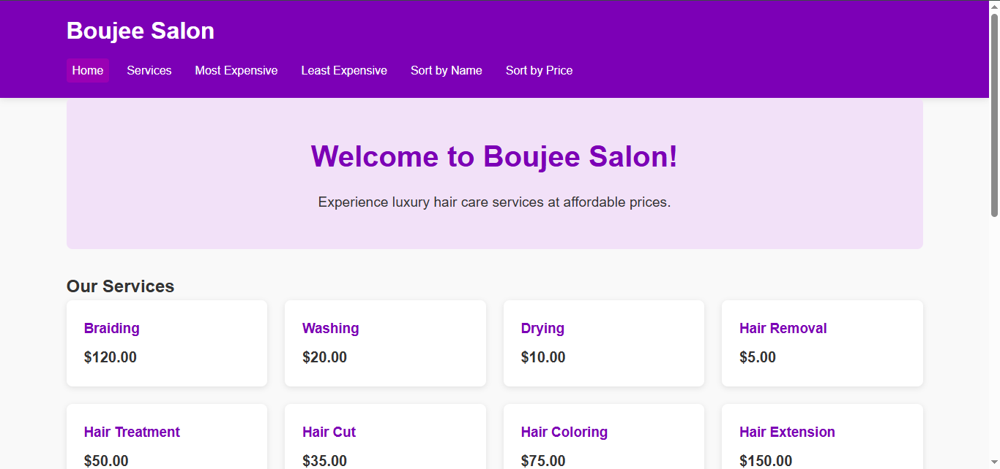

# Hair Salon Flask Web Application - The Boujee Salon


A Flask web application for managing hair salon services and pricing, allowing users to view, search, and sort services. It uses PostgreSQL for data storage and provides a RESTful API for easy access.


## Features

* View all services and prices
* Sort services by name or price
* Find the most and least expensive services
* RESTful API for interacting with services and prices

## Tech Stack

* **Backend**: Flask
* **Database**: PostgreSQL
* **Frontend**: HTML/CSS/JavaScript
* **Tools**: Postman (API testing), DBeaver (for local hosting of PostgreSQL), Neon (serverless hosting of connected DBeaver database for vercel app hosting)

## Setup and Installation

### Prerequisites

- Python 3.12.4 or higher
- DBeaver + Neon
- pip (Python package manager)

### Database Setup

1. Install DBeaver and configure the settings for your Neon database for PostgreSQL. That is insert the connection string/parameter details from Neon into the setup for DBeaver.
2. Open a new script and set up tables and relationships.
3. In Neon, ensure the tables added in the script reflect in the Table view.
4. In Neon's SQL editor, run th insert queries to populate the tables. Return to Table view to confirm.
5. Now, the connection between DBeaver and Neon is established amd runs smoothly.

### Application Setup

1. Clone the repository:
   ```
   git clone https://github.com/InezAnneMarie/hairsalon-flask-web-app.git
   cd hairsalon-flask-web-app
   ```

2. Create a virtual environment and activate it:
   ```
   python -m venv venv
   # On Windows
   venv\Scripts\activate
   # On macOS/Linux
   source venv/bin/activate
   ```

3. Install the required packages:
   ```
   pip install -r requirements.txt
   ```

4. Set up environment variables:
   ```
   # On Windows
   set FLASK_APP=app.py
   set FLASK_ENV=development
   # On macOS/Linux
   export FLASK_APP=app.py
   export FLASK_ENV=development
   ```

5. Test the app.py database connection in DBeaver with your Neon credentials.

6. Run the application:
   ```
   flask run
   ```

7. Access the application at [project link](https://hair-salon-flask-web-app.vercel.app/)

## API Endpoints

| Endpoint | Method | Description |
|----------|--------|-------------|
| `/api/services` | GET | Get all services |
| `/api/services/<id>` | GET | Get service by ID |
| `/api/services` | POST | Add a new service |
| `/api/services/<id>` | PUT | Update a service |
| `/api/services/<id>` | DELETE | Delete a service |
| `/api/services/sort/name` | GET | Get services sorted by name |
| `/api/services/sort/price` | GET | Get services sorted by price |
| `/api/services/most-expensive` | GET | Get the most expensive service |
| `/api/services/least-expensive` | GET | Get the least expensive service |

## Usage Examples

### Web Interface

1. Navigate to [project link](https://hair-salon-flask-web-app.vercel.app/) to view the main page.
2. Click on "Services" to view all available salon services
3. Click on column headers to sort by name or price

## Contributing
-- This is a very basic project for learning purposes. Contributions and constructive criticisms are highly welcome. I still work on this from time to time. Pull requests are welcome :)

1. Fork the repository
2. Create a feature branch: `git checkout -b feature-name`
3. Commit your changes: `git commit -m 'Add some feature'`
4. Push to the branch: `git push origin feature-name`
5. Submit a pull request

## License

This project is licensed under the MIT License - see the LICENSE file for details.

## Acknowledgements

* Flask documentation
* Neon blogs
* PostgreSQL documentation

## Side Note

This project is still under construction (especially with the API testing). What you see now is v2. v1 never ran and it was started in 2023. Recently decided to make changed and improve it so here we are.

Progress over perfection💜
